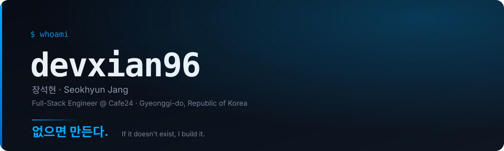

**장석현 (Seokhyun Jang)** · Full-Stack Engineer @ [Cafe24](https://www.cafe24.com)
경력 6년 11개월 · 경기도, 대한민국

코드는 순간의 결과물이지만 그것이 만드는 경험은 오래 남습니다.
기능을 구현하는 데 그치지 않고, 삶 속에 자연스럽게 스며드는 경험을 만들고자 합니다.

---

## 지금 만들고 있는 것

### [카페24 AI 홈페이지 빌더](https://homebuilder.cafe24.com/) · 2026.03 — 진행중

업종만 고르면 AI가 홈페이지 한 채를 통째로 짓고, 대화로 문구·이미지·색·분위기를 고쳐 나가는 완전 관리형 빌더입니다.
기획·디자인·프론트엔드·백엔드가 다 함께 AI를 쓰는 협업 프로세스를 세우고 3개월 만에 냈습니다.

- 프로젝트 전체 91%를 바이브코딩으로 개발
- 커스텀 ESLint 룰 · Claude Skills · husky로 스파게티 코드 차단
- 아토믹 디자인 + DDD 컴포넌트 설계, 온보딩 퍼널 설계
- 어드민 대시보드 · 예약 · 설정 · 부가서비스 전반

`Next.js` `React` `TypeScript` `TanStack Query` `shadcn/ui` `Tailwind` `Zustand` `Orval`

---

## 대표 이력

| 기간 | 소속 | 만든 것 |
| --- | --- | --- |
| 2021.10 — 재직중 | **카페24** · 정규직 | AI 홈페이지 빌더, 사내 AI 플랫폼, 애널리틱스, EC 어드민, [에디봇](https://edibot.cafe24.com) |
| 2022.02 — 재직중 | **BUZZLE** · coFound | 노코드 웹빌더 [buzzle.tools](https://buzzle.tools), 디자인 시스템 [@buzzle/bds](https://www.npmjs.com/package/@buzzle/bds) |
| 2022.10 — 2024.02 | IT 커뮤니티 코파운드 | 질의응답·채팅 커뮤니티, 6인팀 리드 |
| 2021.03 — 2021.07 | 주식회사 소프트젠 · 인턴 | LSTM 기반 AI 관제 시스템 |
| 2020.08 — 2021.02 | 하이퍼 팀 프로젝트 | 라이센스 관리 시스템, Electron 빌더 |
| 2019.12 — 2020.07 | 헤이버디 | 골프 장비 추천 서비스 |

전체 프로젝트와 실제 화면은 [포트폴리오](https://devxian96.github.io)에 있습니다.

---

## 없어서 만들었습니다

필요한 부품이 없으면 만들어서 끼웠습니다.

| 만든 것 | 왜 만들었나 | |
| --- | --- | --- |
| [**phpExpress**](https://github.com/devxian96/phpExpress) | PHP엔 Express 같은 가벼운 REST 프레임워크가 없어서 | `PHP` |
| [**neomo**](https://github.com/neomorphism/neomo) | 뉴모피즘을 매번 손으로 그리기 싫어서 | `CSS` |
| [**react-global-components**](https://github.com/devxian96/react-global-components) | Vue엔 있는 글로벌 컴포넌트가 React엔 없어서 | `JavaScript` |
| [**nsus**](https://github.com/devxian96/nsus) | `useState`만으로는 상태를 다 감당할 수 없어서 | `TypeScript` |
| [**no-lib-club**](https://github.com/devxian96/no-lib-club) | 라이브러리 없이 어디까지 되는지 궁금해서 | `TypeScript` |
| [**@buzzle/bds**](https://www.npmjs.com/package/@buzzle/bds) | 사이드 프로젝트에 새 사람이 와도 바로 붙을 수 있게 | `React` `MUI` |

---

## 기술 스택

**Frontend**

**Backend & Data**

**AI Engineering & Tooling**

---

**없으면 만듭니다.** 없는 걸 만들어야 하는 자리라면 잘 맞습니다.

[coolman555@me.com](mailto:coolman555@me.com) · [devxian96.github.io](https://devxian96.github.io)

