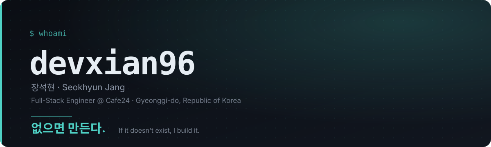

### 없어서 만들었습니다

| 만든 것 | 왜 |  |
| --- | --- | --- |
| [**phpExpress**](https://github.com/devxian96/phpExpress) | PHP엔 Express 같은 가벼운 REST 프레임워크가 없어서 | `PHP` |
| [**react-global-components**](https://github.com/devxian96/react-global-components) | Vue엔 있는 글로벌 컴포넌트가 React엔 없어서 | `JavaScript` |
| [**nsus**](https://github.com/devxian96/nsus) | `useState`만으로는 상태를 다 감당할 수 없어서 | `TypeScript` |
| [**no-lib-club**](https://github.com/devxian96/no-lib-club) | 라이브러리 없이 어디까지 되는지 궁금해서 | `TypeScript` |
| [**linux-monitor**](https://github.com/devxian96/linux-mornitor) | 서버 상태를 브라우저에서 보고 싶어서 | `JavaScript` |
| [**BackMusic**](https://github.com/devxian96/BackMusic) | 윈도우에서 배경음악만 조용히 틀고 싶어서 | `AutoIt` |

프레임워크가 없어서 만들었고, 라이브러리가 아쉬워서 만들었고,
라이브러리 없이도 되는지 궁금해서 클럽을 만들었습니다.

### 지금

**Cafe24** 에디봇 — 쇼핑몰 상세페이지를 브라우저에서 편집하는 에디터를 만듭니다. (2021.10 ~ )

- HTML · Blob · SVG · Canvas를 겹쳐 만든 이미지 블러 필터
- 사용자 UI 기반 클라이언트 에러 트래커 로그 수집기 (Sentry.io와 비슷한 것을 직접)
- 스티커 자유 변형, 텍스트 길이에 따른 자동 크기 조절
- 편집 중인 상세페이지 저장 / 불러오기 (JS · PHP · Redis)

### 쓰는 것들

### 덧

정보보안에 진심이던 시절이 있었습니다. 배틀그라운드 핵 개발 취약점, 운전면허 갱신 조회 서비스의
개인정보 노출까지 네 번 제보했고, "그런 취약점은 없다"는 답변과 함께 당일 조용히 패치되는 걸 보고
방향을 바꿨습니다. 지금은 부수는 쪽 대신 만드는 쪽에 있습니다.

 

  

